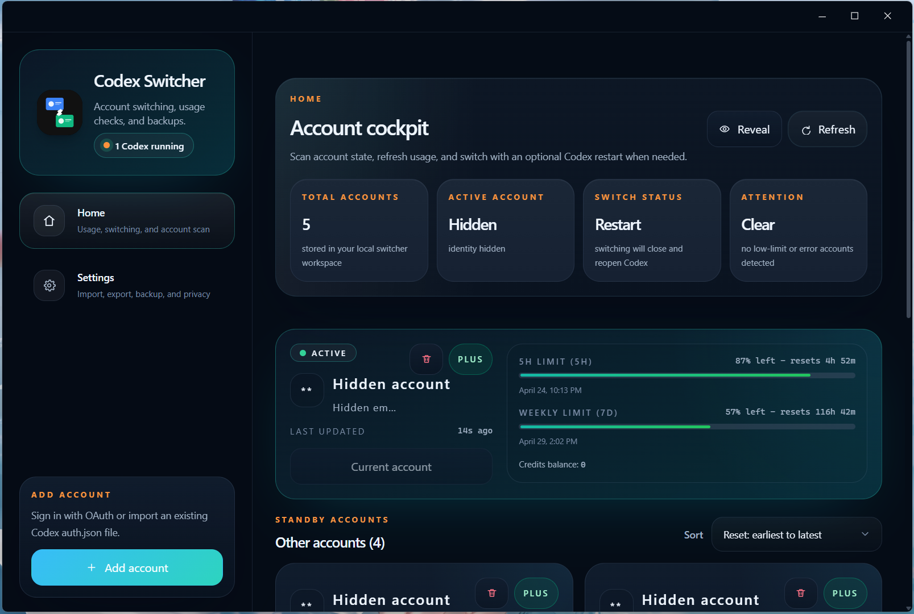
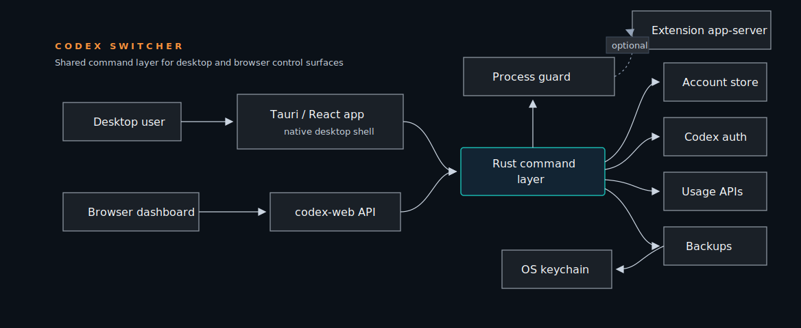

<p align="center">
  
</p>

# Codex Switcher

A desktop-first account manager for Codex CLI users who work with multiple personal OpenAI or ChatGPT accounts.

Codex Switcher keeps account switching, usage checks, backups, privacy controls, and optional browser access in one focused app.

> Forked from [Lampese/codex-switcher](https://github.com/Lampese/codex-switcher). This project has left the fork network and now continues independently.


Quick Start | Features | Browser Mode | Backups | Development | Safety Notes

> The browser server binds to `127.0.0.1` by default. LAN access requires HTTP Basic auth.

## Interface Preview



## Why Codex Switcher

Codex Switcher is built for people who legitimately own multiple Codex-compatible accounts and want a safer way to move between them without manually editing `auth.json`.

It gives you:

- One place to manage Codex accounts
- Fast account switching with process-safety checks
- Usage visibility for account limits
- Restart-and-switch support when Codex is already running
- Slim text import/export and encrypted full backups
- Optional local browser dashboard for LAN or remote-host workflows

## Feature Set

### Account Switching

Switch the active Codex account from a desktop UI. The app updates the local Codex auth file and refreshes last-used metadata.

### Restart Switching

When enabled, Codex Switcher can close running Codex windows, switch accounts, and reopen the captured Codex process command.

### Usage Checks

Refresh account usage, warm up accounts, and see 5-hour and weekly limit state from the dashboard.

### Imports and Backups

Import existing `auth.json` files, export compact slim text payloads, or create encrypted full `.cswf` backups.

### Privacy Controls

Mask account names, emails, and initials across the UI when sharing your screen.

### Browser Mode

Serve the same dashboard over HTTP for local browser testing, LAN access, Tailscale, or remote-host workflows.

## Control Surfaces

| Surface | Best For | Notes |
| --- | --- | --- |
| Desktop app | Daily use | Tauri shell with native dialogs and updater support |
| Browser dashboard | Local/LAN testing | Runs through the `codex-web` server |
| Slim transfer | Quick migration | Compact text import/export for account definitions |
| Full backup | Local recovery | Encrypted `.cswf` backup bound to the current machine/profile |

## Architecture

The desktop app and browser dashboard share the same Rust command layer, so account switching and backup behavior stay consistent across both surfaces.



## Quick Start

### 1. Install prerequisites

- Node.js 18+
- pnpm through Corepack
- Rust through rustup

### 2. Install dependencies

```bash
corepack pnpm install
```

### 3. Run the desktop app in development

```bash
corepack pnpm tauri dev
```

### 4. Build the desktop app

```bash
corepack pnpm build:app
```

Build outputs:

- Frontend files: `build/web/`
- Desktop executable: `build/tauri-target/release/codex-switcher.exe`
- Installers: `build/tauri-target/release/bundle/`

For signed updater artifacts:

```bash
corepack pnpm build:app:signed
```

## Browser Mode

Build the frontend and start the local web server:

```bash
corepack pnpm lan
```

Open:

```text
http://127.0.0.1:3210
```

### LAN Access

PowerShell:

```powershell
$env:CODEX_SWITCHER_WEB_HOST="0.0.0.0"
$env:CODEX_SWITCHER_WEB_PASSWORD="change-me"
corepack pnpm lan
```

Bash:

```bash
CODEX_SWITCHER_WEB_HOST=0.0.0.0 CODEX_SWITCHER_WEB_PASSWORD=change-me corepack pnpm lan
```

Open from another device:

```text
http://YOUR_PC_IP:3210
```

HTTP Basic auth username:

```text
codex
```

## Configuration

| Variable | Required | Description |
| --- | --- | --- |
| `CODEX_HOME` | No | Overrides the Codex config directory used for `auth.json` |
| `CODEX_SWITCHER_CONFIG_DIR` | No | Overrides the Codex Switcher account store directory |
| `CODEX_SWITCHER_WEB_HOST` | No | Browser server bind host, defaults to `127.0.0.1` |
| `CODEX_SWITCHER_WEB_PORT` | No | Browser server port, defaults to `3210` |
| `CODEX_SWITCHER_WEB_PASSWORD` | Required for non-loopback | Enables HTTP Basic auth for browser mode |
| `CODEX_SWITCHER_WEB_TOKEN` | No | Legacy alias for `CODEX_SWITCHER_WEB_PASSWORD` |

## Backups

Codex Switcher supports two backup paths.

| Format | Best For | Security Model |
| --- | --- | --- |
| Slim text | Quick transfer | Compact payload containing account secrets |
| Full `.cswf` | Local recovery | Encrypted with a machine-bound key stored in the OS keychain |

New full backups are machine-bound. A `.cswf` file exported on one machine/profile can only be restored from the same machine/profile.

Legacy `.cswf` backups using the older built-in passphrase format remain importable, but new exports use the machine-bound format.

## Process Safety

Codex Switcher checks for running Codex app instances before switching accounts.

Current behavior:

- Normal switching is blocked while live Codex windows are running.
- Restart switching can close Codex, switch accounts, and reopen captured Codex processes.
- Matching Antigravity/OpenAI extension app-server processes are restarted after account activation so they pick up the new auth file.
- Background or stale Codex helper processes are ignored when they are not active app windows.

## Development

Useful commands:

```bash
corepack pnpm typecheck
corepack pnpm test
corepack pnpm format:check
cargo fmt --check --manifest-path src-tauri/Cargo.toml
cargo test --manifest-path src-tauri/Cargo.toml
cargo clippy --manifest-path src-tauri/Cargo.toml --all-targets -- -D warnings
```

Project layout:

```text
.
|-- src/              React app
|-- src-tauri/        Rust backend and Tauri shell
|-- scripts/          Build, LAN, and release helpers
|-- public/           Static frontend assets
`-- build/            Generated build output
```

## Versioning

Keep package, Tauri, Cargo, and lockfile versions in sync:

```bash
corepack pnpm version:patch
corepack pnpm version:minor
corepack pnpm version:major
```

Prepare a release commit and tag:

```bash
corepack pnpm release patch
```

Prepare and push:

```bash
corepack pnpm release patch -- --push
```

## Safety Notes

Codex Switcher is intended for accounts you personally own.

It is not intended for:

- Sharing accounts between multiple users
- Account pooling
- Circumventing OpenAI terms or usage policies

Slim exports contain account secrets. Treat them like credentials.

## Summary

Codex Switcher is a focused desktop utility for managing multiple personal Codex accounts with safer switching, clear usage visibility, encrypted local backups, and an optional browser dashboard for controlled local or LAN access.
